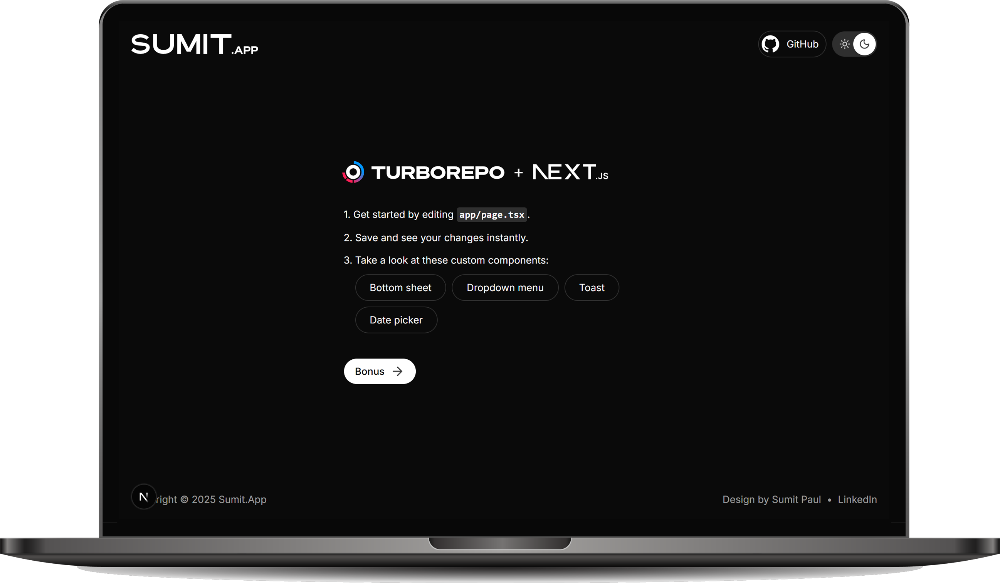
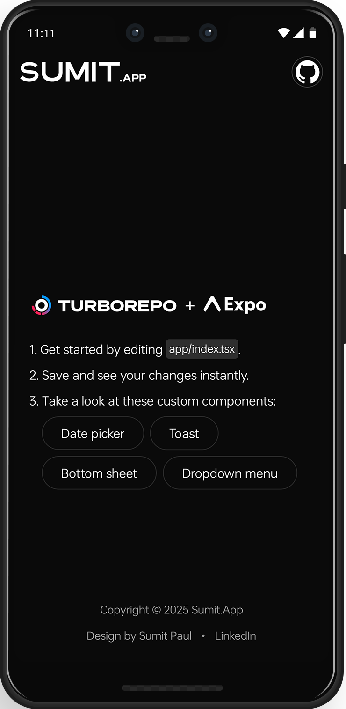

<div align="center">
  
  
  
  <br />
  <br />
  
  <p><strong>Rapidly build modern apps with everything pre-configured and ready to use.</strong></p>
  
  <p>A monorepo pre-configured project powered by <strong>Turborepo</strong>, featuring a <strong>Next.js</strong> web app, an <strong>Expo</strong> mobile app, and <strong>Node.js</strong> Vercel serverless APIs.</p>

  <br />

[](https://github.com/sumittttpaul/SumitApp)
[](https://github.com/sumittttpaul/SumitApp)
[](https://www.typescriptlang.org/)
[](https://reactjs.org/)
[](https://nextjs.org/)
[](https://expo.dev/)
[](https://turbo.build/)

</div>

---

## 🚀 Quick Start

Get started with SumitApp in seconds:

```bash
npx create-sumit-app my-app
cd my-app
bun dev
```

Or install in the current directory:

```bash
npx create-sumit-app
```

## 📱 Screenshots

<div align="center" >
  
  &nbsp;&nbsp;&nbsp;&nbsp;
  
</div>

## ✨ Features

### 🏗️ **Monorepo Architecture**

- **Turborepo** for blazing-fast builds and caching
- Shared packages for components, utilities, and configurations
- Optimized workspace management with Bun

### 🌐 **Multi-Platform Development**

- **Next.js 15** web application with App Router
- **Expo 54** mobile app for iOS and Android
- **Node.js** serverless APIs with Vercel deployment

### 🎨 **Modern UI/UX**

- **Tailwind CSS 4** for styling
- **Shadcn UI** components for accessibility
- **React Native Paper** for mobile UI
- Dark/Light theme support
- Responsive design across all platforms

### 🛠️ **Developer Experience**

- **TypeScript** for type safety
- **ESLint** and **Prettier** for code quality
- **React Compiler** for optimized builds
- Hot reload and fast refresh
- Comprehensive tooling and scripts

### 📦 **Shared Packages**

- `@packages/components` - Reusable UI components
- `@packages/hooks` - Custom React hooks
- `@packages/utils` - Utility functions
- `@packages/validations` - Zod schemas
- `@packages/types` - TypeScript definitions

## 🏛️ Project Structure

```
sumitapp/
├── 📁 assets/                    # Brand assets and logos
├── 🛠️ cli-tool/                 # create-sumit-app CLI
├── 🌐 official-site/            # Official documentation site
└── 📦 project-template/         # Main project template
    ├── 📁 packages/             # Shared packages
    │   ├── components/          # UI components
    │   ├── hooks/              # React hooks
    │   ├── utils/              # Utilities
    │   ├── validations/        # Zod schemas
    │   ├── types/              # TypeScript types
    │   ├── eslint-config/      # ESLint configuration
    │   └── typescript-config/  # TypeScript configuration
    └── 📁 projects/            # Applications
        ├── 🌐 website/         # Next.js web app
        ├── 📱 mobile/          # Expo mobile app
        └── ⚡ backend/         # Node.js API
```

## 🚀 Available Scripts

### Root Commands

```bash
bun dev          # Start all projects in development mode
bun build        # Build all projects
bun lint         # Lint all projects
bun format       # Format code with Prettier
bun check-types  # Type check all projects
bun clean        # Clean all build artifacts (Note: Before cleaning, ensure the editor/IDE is closed.)
```

### Individual Project Commands

```bash
# Website (Next.js)
bun --filter=website dev
cd projects/website
bun dev          # Start development server
bun build        # Build for production
bun start        # Start production server

# Mobile (Expo)
bun --filter=mobile dev
cd projects/mobile
bun dev          # Start Expo development server
bun android      # Run on Android device/emulator
bun ios          # Run on iOS device/simulator

# Backend (Node.js)
bun --filter=backend dev
cd projects/backend
bun dev          # Start development server
bun build        # Build for production
```

## 🌐 Vercel Deployment Guide

SumitApp is optimized for Vercel deployment with support for both the Next.js website and Node.js serverless APIs. Follow these steps to deploy your project using the Vercel Dashboard:

### 📋 Prerequisites

1. **GitHub Repository**: Push your code to a GitHub repository
2. **Vercel Account**: Sign up at [vercel.com](https://vercel.com)
3. **Environment Variables**: Prepare any required environment variables

### 🚀 Deployment Steps

#### Step 1: Import Your Repository

1. Go to [vercel.com/dashboard](https://vercel.com/dashboard)
2. Click **"Add New..."** → **"Project"**
3. Select **"Import Git Repository"**
4. Choose your GitHub repository containing the SumitApp project
5. Click **"Import"**

#### Step 2: Configure Your Deployments

You'll need to create **two separate deployments** for optimal performance:

##### 🌐 **Website Deployment (Next.js)**

1. **Project Settings:**

   - **Project Name**: `your-app-name-website`
   - **Framework Preset**: **Next.js**
   - **Root Directory**: `projects/website`

2. **Build & Development Settings:**

   - **Build Command**: `cd ../.. && bun run build --filter=website`
   - **Output Directory**: `.next`
   - **Install Command**: `cd ../.. && bun install`
   - **Development Command**: `cd ../.. && bun run dev --filter=website`

3. **Environment Variables** (if needed):

   - Add any frontend-specific environment variables
   - Example: `NEXT_PUBLIC_API_URL`, `NEXT_PUBLIC_SITE_URL`

4. Click **"Deploy"**

##### ⚡ **Backend API Deployment (Node.js)**

1. **Create Second Project:**

   - Go back to Vercel dashboard
   - Import the same repository again
   - **Project Name**: `your-app-name-api`

2. **Project Settings:**

   - **Framework Preset**: **Other**
   - **Root Directory**: Leave empty (deploy from root)

3. **Build & Development Settings:**

   - **Build Command**: `bun run build --filter=backend`
   - **Output Directory**: `projects/backend/dist`
   - **Install Command**: `bun install`
   - **Development Command**: `bun run dev --filter=backend`

4. **Functions Configuration:**

   - Vercel will automatically detect API routes in `projects/backend/api/`
   - No additional configuration needed

5. **Environment Variables** (if needed):

   - Add backend-specific environment variables
   - Example: `DATABASE_URL`, `JWT_SECRET`, `API_KEY`

6. Click **"Deploy"**

#### Step 3: Configure Custom Domains (Optional)

1. **Website Domain:**

   - In your website project settings, go to **"Domains"**
   - Add your custom domain (e.g., `yourapp.com`)
   - Follow DNS configuration instructions

2. **API Domain:**
   - In your backend project settings, go to **"Domains"**
   - Add your API subdomain (e.g., `api.yourapp.com`)
   - Update your frontend to use the new API URL

### 📊 Post-Deployment Checklist

- [ ] **Website loads correctly** at the Vercel URL
- [ ] **API endpoints respond** properly
- [ ] **Environment variables** are configured
- [ ] **Custom domains** are set up (if applicable)
- [ ] **CORS settings** allow frontend to access backend
- [ ] **Database connections** work (if applicable)
- [ ] **Error monitoring** is set up

### 🔄 Continuous Deployment

Once configured, Vercel will automatically:

- **Deploy on git push** to your main branch
- **Preview deployments** for pull requests
- **Rollback** if builds fail
- **Cache builds** for faster deployments

## 🛠️ Technology Stack

### **Frontend**

- **Next.js 15** - React framework with App Router
- **React 19** - Latest React with concurrent features
- **Tailwind CSS 4** - Utility-first CSS framework
- **Radix UI** - Accessible component primitives
- **Motion** - Animation library
- **Lucide React** - Beautiful icons

### **Mobile**

- **Expo 54** - React Native development platform
- **React Native 0.81** - Cross-platform mobile framework
- **NativeWind** - Tailwind CSS for React Native
- **React Native Paper** - Material Design components
- **Expo Router** - File-based routing

### **Backend**

- **Node.js** - JavaScript runtime
- **Express 5** - Web framework
- **Vercel** - Serverless deployment platform
- **TypeScript** - Type-safe JavaScript

### **Development Tools**

- **Turborepo** - Monorepo build system
- **Bun** - Fast JavaScript runtime and package manager
- **TypeScript** - Static type checking
- **ESLint** - Code linting
- **Prettier** - Code formatting
- **React Compiler** - Optimizing compiler

### **State Management & Utilities**

- **Legend State** - Fast and flexible state management
- **Zod** - TypeScript-first schema validation
- **Date-fns** - Date utility library
- **Axios** - HTTP client

## 👨‍💻 Author

**Sumit Paul**

- Website: [sumitttpaul.vercel.app](https://sumitttpaul.vercel.app/)
- LinkedIn: [@sumitttpaul](https://www.linkedin.com/in/sumitttpaul/)
- GitHub: [@sumittttpaul](https://github.com/sumittttpaul)

## 🙏 Acknowledgments

- [Turborepo](https://turbo.build/) for the amazing monorepo tooling
- [Next.js](https://nextjs.org/) for the incredible React framework
- [Expo](https://expo.dev/) for simplifying mobile development
- [Vercel](https://vercel.com/) for seamless deployment

---

<div align="center">
  <p>Made with ❤️ by <a href="https://sumitttpaul.vercel.app/">Sumit Paul</a></p>
  <p>⭐ Star this repo if you find it helpful!</p>
</div>
